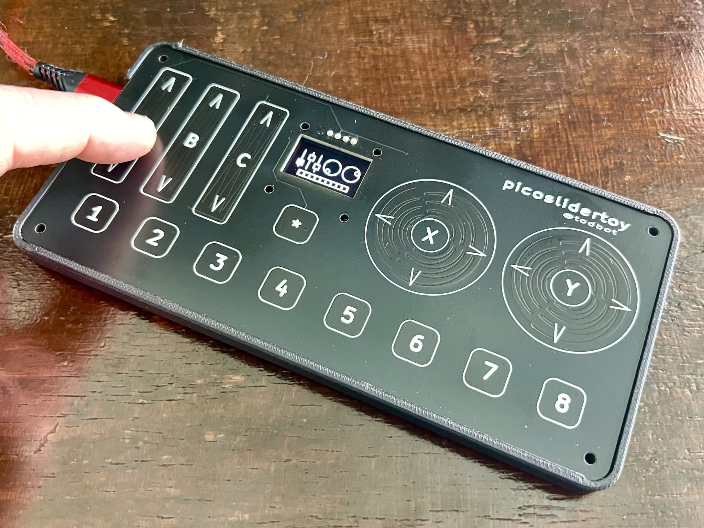
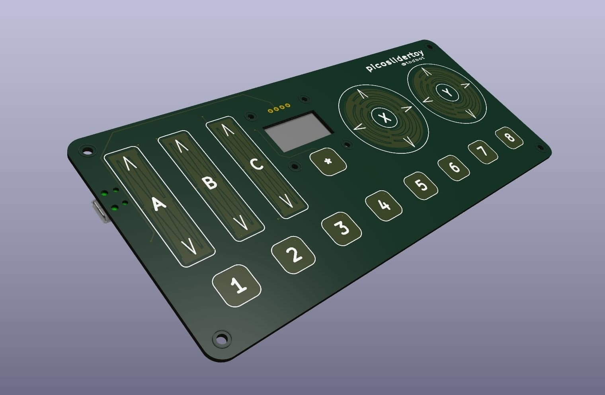

# picoslidertoy
  
<a href="https://www.tindie.com/products/todbot/picoslidertoy-capsense-controller-for-pico/">
</a>
<a href="https://www.tindie.com/products/todbot/picoslidertoy-capsense-controller-for-pico/"></a>

## Table of contents 
   * [What is it?](#what-is-it)
   * [Variants](#variants)
   * [Parts needed](#parts-needed)
   * [Soldering components](#soldering-components)
   * [Installing apps](#installing-apps)
   * [Why?](#why)


## What is it?
[picoslidertoy](https://github.com/todbot/picoslidertoy) is a touch-sensitive 
control surface that uses 24 GPIO pins of the Raspberry Pi Pico to provide:

- three linear sliders
- two rotary sliders
- nine buttons
- all capacitive touch 

It also includes a cutout for a reverse-mounted SSD1306 I2C OLED display. The Raspberry Pi Pico SMD mounts to the back of the board to provide a clean look for the touch surface.  The entire PCB is 165 mm x 76 mm (6.5" x 3.0").

The picoslidertoy can be a USB MIDI control surface, a USB Macropad keyboard with "analog" controls, or even a USB gamepad.  It can be programmed in [CircuitPython](https://circuitpython.org/) and [`touchio`](https://docs.circuitpython.org/en/latest/shared-bindings/touchio/index.html) or Arduino with my [`TouchyTouch library`](https://github.com/todbot/TouchyTouch).  Several example firmware apps are provided.
   
   
## Variants

There are two versions of the picoslidertoy available:

- black PCB -- production version with proper alignment of the cutout for standard 0.96" I2C OLED, comes with all SMD resistors soldered down  Note: the silkscreen on the back has a typo, saying `0.91" I2C OLED`. 

- green PCB -- prototype version with no components soldered down and where the I2C OLED display cutout is a little off. Still usable, or mount the display on the face. 

There is also a nice minimal 3d-printable enclosure available in the github repo (and visible in the photos above).  You really want a case for capacitive touch projects like this to reduce spurious readings. 


## Parts needed

In addition to the [picoslidertoy PCB](https://www.tindie.com/products/todbot/picoslidertoy-capsense-controller-for-pico/), you will need:

- Raspberry Pi Pico 
  - Must be w/ castellated pads & w/o headers,  ([like this](https://amzn.to/4d0KFZC))
  - For USB-C, consider this [USB-C 16 MB Pico clone](https://www.aliexpress.us/item/3256804731684211.html)
  
- I2C OLED display SSD1306 
   - 0.96" 128 x 64 pixels, in white
   - Pins must be in GND,VCC,SCL,SDA order 
   - Prefer the 27.5 mm wide displays over the 25 mm wide ones ([one example](https://amzn.to/3KDmy73))


- (If you have a green proto one, you will also need 24 x 1M 0603 resistors and 2 x 10k 0603 resistors)


## Soldering components

- **Pico**  -- the Pico is soldered down surface-mount style, using its castellated pads. 
  [This video soldering a Pico on picotouch](https://github.com/todbot/picotouch?tab=readme-ov-file#how-to-solder-the-pico) is how I do it for this board too.  It's technically surface-mount soldering, 
  but the pads are bigger than most through-hole pads and easy to solder to. 
  Note that Pico clones that don't have castellated pads like the real Pico will
  not work. 
  ([Youtube video with Pico SMD soldering tips](https://www.youtube.com/watch?v=dW9LiOq3Dso "Pico SMD soldering"))
  [](https://www.youtube.com/watch?v=dW9LiOq3Dso "Pico SMD soldering")
  
- **OLED Display** -- the display can either be mounted on the front (especially easy if your display's pins
  come pre-soldered) or from the back (my preference).  If mounting from the back, you first need to 
  desolder the 4-pin header on the display and mount a new 4-pin header "reverse" so that pins stick up
  from the front of the display. The main header body is still on the back of the display. 
  (The video below hopefully makes this clearer).  When soldering, do one pin first and check alignment,
  then solder the rest of the pins. Finish up by trimming the excess header pins. 
  ([Youtube video with picoslidertoy soldering tips](https://www.youtube.com/watch?v=zxt3xpre2Vg))
  [](https://www.youtube.com/watch?v=zxt3xpre2Vg "picoslidertoy soldering tips")


## Firmware installation / Installing apps

### CircuitPython apps

These are the apps currently available 
- [hwtest](https://github.com/todbot/picoslidertoy/blob/main/circuitpython/hwtest/code.py)
    -- a simple test of the touch sensors, no display needed. Use serial REPL to see results

- [hwtest display](https://github.com/todbot/picoslidertoy/blob/main/circuitpython/hwtest_display/code.py) -- like `hwtest` but also outputs simple feedback via the display
 
- [midi_sliders](https://github.com/todbot/picoslidertoy/blob/main/circuitpython/midi_sliders/) -- MIDI controller where the sliders emit CCs and the buttons send NoteOn/NoteOffs


If you've never used a Pico or CircuitPython, there are several ways to put code on it. 
The two main ways I'll present here are:

- Ready-to-go UF2 file in "Releases" 
- Installing by hand:  CircuitPython, code.py, libraries 

### Ready-to-go UF2 file

Steps to install a UF2 file:

- Download a ready-to-go UF2 file from the [Releases section](https://github.com/todbot/picoslidertoy/releases) section
- Hold the BOOTSEL button on the picoslidertoy's Pico while plugging it into your computer
- Copy the UF2 file to the "RPI-RP2" Pico bootloader drive 
- Wait for a bit, then app is running!

In general, I'll try to make UF2 files available in the [Releases section](https://github.com/todbot/picoslidertoy/releases) for the differnt apps.

### Installing by hand 

Steps to install by hand: 

- Download this repo, either with a `git clone` or clicking on "Code / Download ZIP"
- Download the latest CircuitPython UF2 for Pico at https://circuitpython.org/board/raspberry_pi_pico/
- Install the CircuitPython UF2 (like in the above UF2 steps)
- Wait for CircuitPython to come up and present a CIRCUITPY drive
- Copy the files of the picoslidertoy app in question to CIRCUITPY:

  e.g. for `midi_sliders`, copy `code.py`, `slider_display.py`, `touchslider.py` to CIRCUITPY
  ```
  cp circuitpython/midi_sliders/* /Volumes/CIRCUITPY  # (if macos)
  ```

   
- Install CircuitPython libraries onto Pico

    If you have Python on your computer you can do:
    ```
    pip3 install circup
    circup install adafruit_midi adafruit_debouncer 
    ```
    Otherwise, download the [CircuitPython Libraries Bundle](https://circuitpython.org/libraries)
    and copy over the `adafruit_midi`, `adafruit_debouncer`, & `adafruit_ticks` libraries
    to the `CIRCUITPY/lib` folder on the Pico.
    


## Why?

I wanted a way to experiment with linear and rotary touch sliders.  I made some [touchwheels](https://github.com/todbot/touchwheels) to give away for Hackaday Supercon 2023 and they were popular. I wanted a larger playground for experimenting with these controls. 

### What makes it special?

The 24 capacitive touch sensors are read directly by the Pico, either via CircuitPython's `touchio` library or the `TouchyTouch` Arduino library.  No external touch chip needed.  I think that's really cool!  Getting an "analog" value out of the three touch sensors that make up a linear or rotary touch slider is fairly simple but there are some tricks I'm developing to make the values stable.

picoslidertoy is also completely open source with schematic files in KiCad and software in CircuitPython and Arduino.


### Press links

- [Adafruit Show-N-Tell Live show 10 Apr 2024](https://www.youtube.com/live/9aliKuS8NTw?si=FC51cfeyoLF2YsNm&t=1055)
- [Hackster.io 11 Apr 2024 article](https://www.hackster.io/news/tod-kurt-s-picoslidertoy-delivers-25-capacitive-touch-inputs-to-a-raspberry-pi-pico-with-sliders-368dca30f01c)


